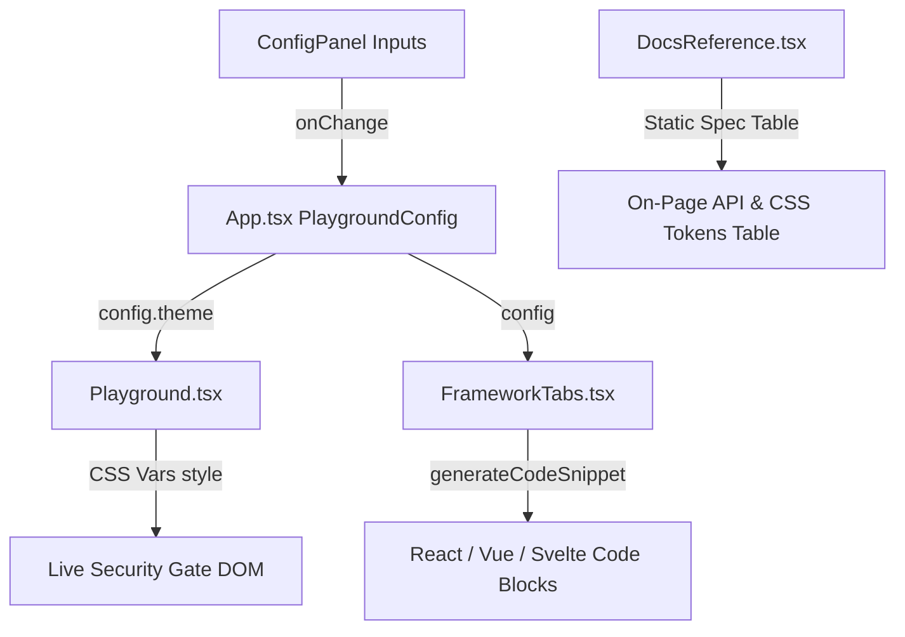

# Design: Docs Demo Full Configuration & CSS Variable Parity

## Architecture Overview

The enhancement spans three primary areas in `apps/docs`:
1. **Config State & Snippet Formatting (`apps/docs/src/utils/snippets.ts`)**:
   - Expand `ThemeConfig` to include:
     - `containerWidth?: number` (maps to `--heelslide-width`)
     - `containerHeight?: number` (maps to `--heelslide-height`)
     - `handleBorderWidth?: number` (`--heelslide-handle-border-width`)
     - `heelBorderWidth?: number` (`--heelslide-heel-border-width`)
     - `targetHeelBorderWidth?: number` (`--heelslide-target-heel-border-width`)
     - `goalBorderWidth?: number` (`--heelslide-goal-border-width`)
     - `successColor?: string` (`--heelslide-success-color`)
     - `errorColor?: string` (`--heelslide-error-color`)
   - Expand `formatReactStyles` and `formatCssDeclarations` to include all matching CSS custom properties, including `--heelslide-width: ${width}px` and `--heelslide-height: ${height}px`.
2. **ConfigPanel & Playground Updates (`apps/docs/src/components/ConfigPanel.tsx`, `Playground.tsx`)**:
   - Add inputs for `gridStep` (e.g. 16 to 48px) and `margin` (e.g. 8 to 32px).
   - Add numeric inputs/sliders for border widths.
   - Add color pickers for `successColor` and `errorColor`.
   - Forward all CSS variables to `Playground` container style so changes are immediately visible in the live preview.
3. **Reference Documentation Component (`apps/docs/src/components/DocsReference.tsx`)**:
   - Render structured tables documenting:
     - **Component Props & Callbacks** (Name, Type, Default, Description).
     - **CSS Custom Properties** (Property, Fallback/Default, Description, Category).
   - Add clean collapsible accordion/tab layout matching the existing dark/light UI design system.

## Data Flow & Synchronization

